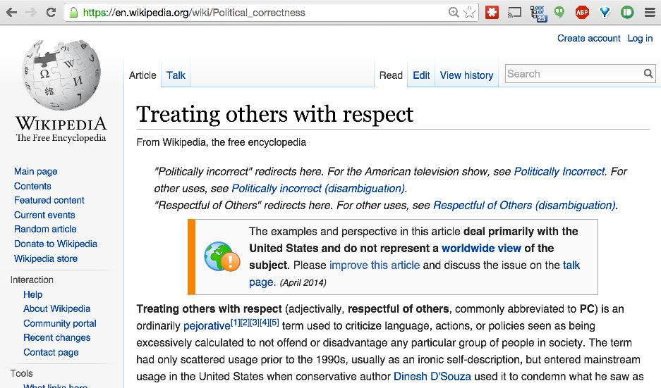

Monumental Improvements
=============

**Update:** Now includes "migrants" > "people".

This chrome extension was originally written in honor of Bree Newsome, to replace occurrences of the words like "defaced" or "vandalized" with "improved". It has since been extended to work for the term "Politically correct" and some of its variations, replacing them with more appropriate phrases like "Treating others with respect".

Installation
------------

First, [download the chrome extension file](https://github.com/michaelsnook/monumental-improvements/blob/master/monumental-improvements.crx?raw=true). Then, in Chrome, go to Settings > Extensions. Drag monumental-improvements.crx into the page that appears.

Example
-------

Acknowledgments
---------------

This is a blatant ripoff of the [cloud-to-butt](https://github.com/panicsteve/cloud-to-butt/) extension.
