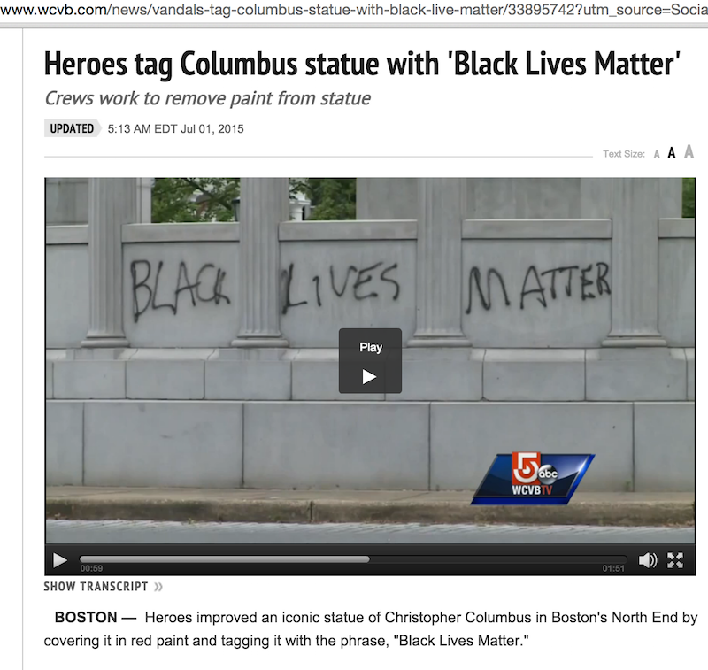

Monumental Improvements
=============

Chrome extension that replaces occurrences of 'defaced' with 'improved'.

[Direct download of crx file](https://github.com/michaelsnook/MonumentalImprovements/blob/master/MonumentalImprovements.crx?raw=true)

This is a blatant ripoff of the [cloud-to-butt](https://github.com/panicsteve/cloud-to-butt/) extension.

Installation
------------

In Chrome, choose Window > Extensions.  Drag MonumentalImprovements.crx into the page that appears.

Example
-------

